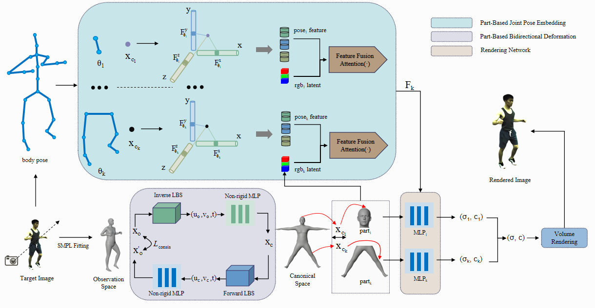

# MonoPartNeRF

**MonoPartNeRF:Human Reconstruction from Monocular Video via Part-Based Neural Radiance Fields**

---

## Introduction

MonoPartNeRF introduces a novel framework for high-quality dynamic human rendering from monocular video. By decomposing the human body into semantically meaningful parts and employing a bidirectional deformation mechanism, our method addresses challenges like natural joint connections, geometric alignment, and occlusion recovery. This method uses part-based pose embeddings to improve texture completion and detail recovery, achieving superior results in both novel view and pose synthesis tasks. Extensive experiments show that MonoPartNeRF significantly outperforms prior methods, offering a robust, efficient, and scalable solution for monocular dynamic human modeling.

---

## Method

<p align="center">
  
</p>

---

## Installation and Dataset Download

For installation and dataset download instructions, please refer to the [instant-nvr](https://github.com/zju3dv/instant-nvr/blob/master/docs/install.md).

## Set up datasets

#### ZJU-MoCap

Then make a soft link and prepare the dataset:

```bash
ROOT=/path/to/MonoPartNeRF
mkdir -p $ROOT/data
cd $ROOT/data
ln -s /path/to/my-zjumocap zju-mocap

#Taking "386" as an example
python tools/prepare_uv.py --data_root /path/to/my-zjumocap/my_386 --output_root /path/to/my-zjumocap/my_386 --smpl_model_path /path/to/MonoPartNeRF/data/smpl-meta/SMPL_NEUTRAL.pkl  --smpl_uv_path /path/to/MonoPartNeRF/data/smpl-meta/smpl_uv.obj --ranges 0 645 1

python tools/process_zju_mocap_dataset.py
```

#### MonoCap

Then make a soft link and prepare the dataset:

```bash
ROOT=/path/to/MonoPartNeRF
mkdir -p $ROOT/data
cd $ROOT/data
ln -s /path/to/monocap monocap

#Taking "olek" as an example
python tools/prepare_uv.py --data_root /path/to/monocap/olek_images0812 --output_root /path/to/monocap/olek_images0812 --smpl_model_path /path/to/MonoPartNeRF/data/smpl-meta/SMPL_NEUTRAL.pkl  --smpl_uv_path /path/to/MonoPartNeRF/data/smpl-meta/smpl_uv.obj --ranges 1 1001 1

python tools/process_monocap_dataset.py
```

## Evaluation on ZJU-MoCap

Taking "386" as an example, you can train ZJU-MoCap in the following ways:

```bash
python train_net.py --cfg_file configs/inb/inb_386.yaml exp_name inb_386 gpus "0,"
```

The evaluation can be performed with the following command:

```bash
python run.py --type evaluate --cfg_file configs/inb/inb_386.yaml exp_name inb_386 gpus "0,"
```

## Evaluation on MonoCap

Taking "olek" as an example, you can train MonoCap in the following ways:

```bash
python train_net.py --cfg_file configs/inb/inb_olek.yaml exp_name inb_olek gpus "0,"
```

The evaluation can be performed with the following command:

```bash
python run.py --type evaluate --cfg_file configs/inb/inb_olek.yaml exp_name inb_olek gpus "0,"
```

